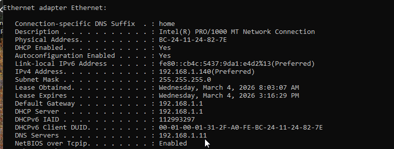
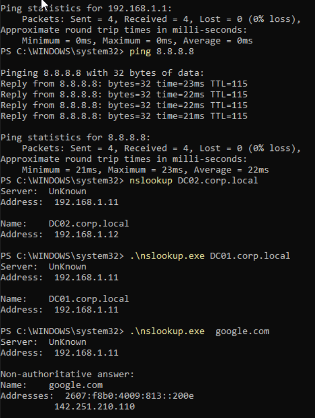
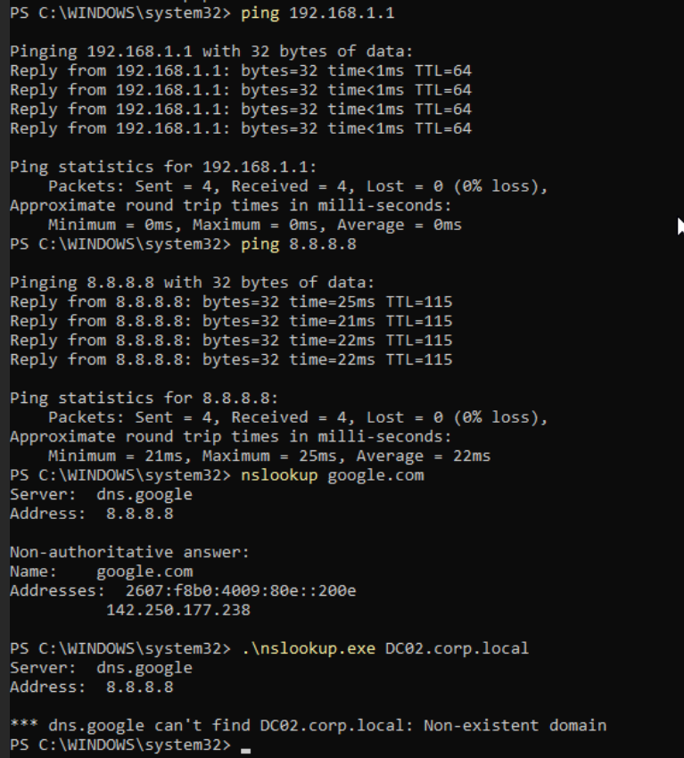
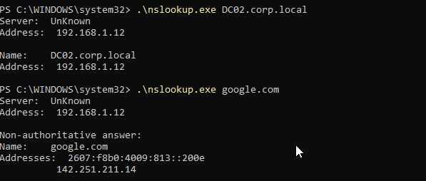

# Lab 01 – No Internet (DNS Misconfiguration)

## Scenario

A user reports that the internet is not working.

Goal: Determine whether the problem is related to:

- Network connectivity
- Routing
- DNS resolution

---

# Step 1 – Baseline Network Configuration

Command: ipconfig /all
Expected values:

- Valid IP address
- Correct default gateway
- DNS server pointing to domain controller

Screenshot:

---

# Step 2 – Connectivity Testing

Test gateway connectivity: ping 192.168.1.1
Test internet routing: ping 8.8.8.8

Results confirm routing is functioning.

Screenshot:

---

# Step 3 – DNS Resolution Test

External DNS test: nslookup google.com
Internal DNS test: nslookup DC01.corp.local

Both resolve correctly when using the domain DNS server.

Screenshot:

---

# Step 4 – Introduce Fault

DNS server was manually changed to: 8.8.8.8

Screenshot:

---

# Step 5 – Test After DNS Change

External DNS lookup: nslookup google.com
Result: Works

Internal DNS lookup: nslookup DC02.corp.local
Result:*** dns.google can't find DC02.corp.local: Non-existent domain

Screenshot:

---

# Root Cause

The client was configured to use a public DNS server.

Public DNS servers cannot resolve internal Active Directory DNS zones such as:

- `corp.local`
- `_ldap._tcp.dc._msdcs.corp.local`

This breaks domain resource discovery.

---

# Fix

Restore DNS to domain controllers.
192.168.1.11
192.168.1.12
Flush DNS cache: ipconfig /flushdns

---

# Verification

nslookup DC02.corp.local
nslookup google.com

Both internal and external resolution now function.

Screenshot:

---

# Key Troubleshooting Pattern

1. Verify IP configuration
2. Test gateway connectivity
3. Test external routing
4. Test DNS resolution
5. Identify root cause
6. Implement fix
7. Verify resolution

