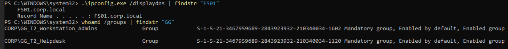
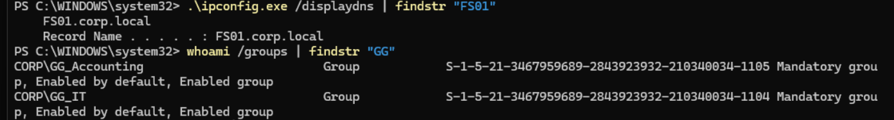
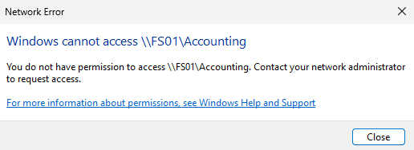
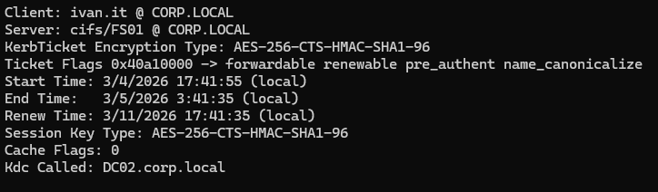
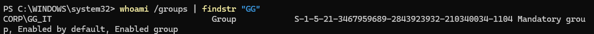

# Lab 02 – Access Denied to Folder (AD Groups / NTFS)

## Scenario

User **ivan.it** reports they cannot access the shared folder:

```
\\FS01\Accounting
```

Goal: Determine why access is denied and restore correct permissions.

---

# Lab Environment

Domain: `corp.local`

| Host | Role              |
| ---- | ----------------- |
| DC01 | Domain Controller |
| DC02 | Domain Controller |
| FS01 | File Server       |
| CL01 | Client            |

User tested:

```
ivan.it
```

---

# Step 1 – Verify Cached DNS Entry

Check whether the client has a cached DNS record for the file server.

Command:

```
ipconfig /displaydns | findstr "FS01"
```

Result confirms the client resolves the file server.

Screenshot:



---

# Step 2 – Inspect User Token (Group Membership)

Check which security groups exist inside the current logon token.

Command:

```
whoami /groups | findstr "GG"
```

Result shows the groups currently applied to the user session.

Example groups:

```
GG_T2_Workstation_Admins
GG_T2_Helpdesk
```

Screenshot:



---

# Step 3 – Access the Share

Attempt to access the share:

```
\\FS01\Accounting
```

Result:

```
Windows cannot access \\FS01\Accounting
```

Screenshot:



---

# Step 4 – Verify Kerberos Service Ticket

Check whether a Kerberos service ticket was issued for the file server.

Command:

```
klist
```

Relevant entry:

```
cifs/fs01.corp.local
```

This confirms the client successfully authenticated to the server.

Screenshot:



---

# Step 5 – Confirm Current Group Membership

After group membership changes, inspect the token again.

Command:

```
whoami /groups | findstr "GG"
```

Result shows only:

```
GG_IT
```

The accounting access group is missing.

Screenshot:



---

# Root Cause

The user **ivan.it** was removed from the Active Directory group that grants access to the Accounting share.

Because the user's current Kerberos token no longer contains the required group SID, authorization on the file server fails.

The server correctly denies access.

---

# Authentication vs Authorization

Important distinction observed in this lab.

Authentication succeeded:

```
Kerberos ticket issued
```

Authorization failed:

```
NTFS permissions did not allow access
```

---

# Resolution

Add the user back to the required group:

```
GG_Accounting
```

Then refresh the user token by:

```
Log out and log back in
```

Verify again:

```
whoami /groups
```

Confirm the group appears in the token and access to the share is restored.

---

# Troubleshooting Tools Used

| Tool                 | Purpose                  |
| -------------------- | ------------------------ |
| ipconfig /displaydns | Verify DNS resolution    |
| whoami /groups       | Inspect user token       |
| klist                | Inspect Kerberos tickets |
| File Explorer        | Test SMB share access    |
| ADUC                 | Manage group membership  |

---

# Key Lessons

• Kerberos authentication does not guarantee authorization
• Access to file shares depends on **NTFS permissions + group membership**
• Active Directory group changes require **token refresh**
• `whoami /groups` is essential for debugging permission issues

---

# Troubleshooting Pattern

1. Confirm the resource path
2. Verify DNS resolution
3. Inspect user token
4. Confirm Kerberos authentication
5. Check group membership
6. Review NTFS/share permissions
7. Apply fix and verify

---

# Commands Reference

```
ipconfig /displaydns
whoami /groups
klist
```

