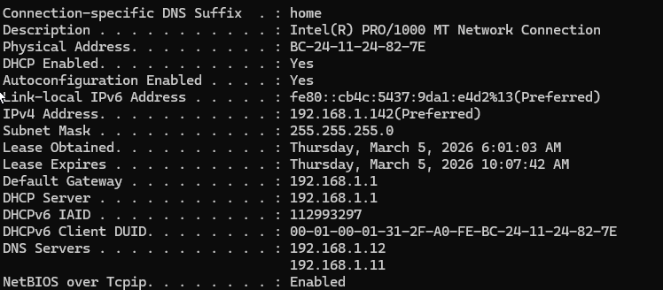
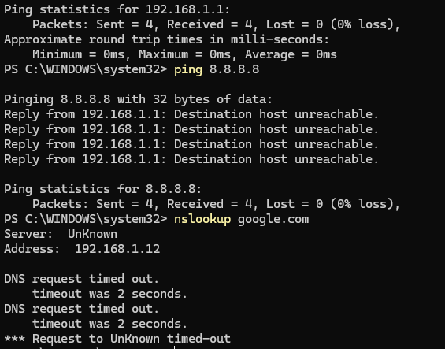
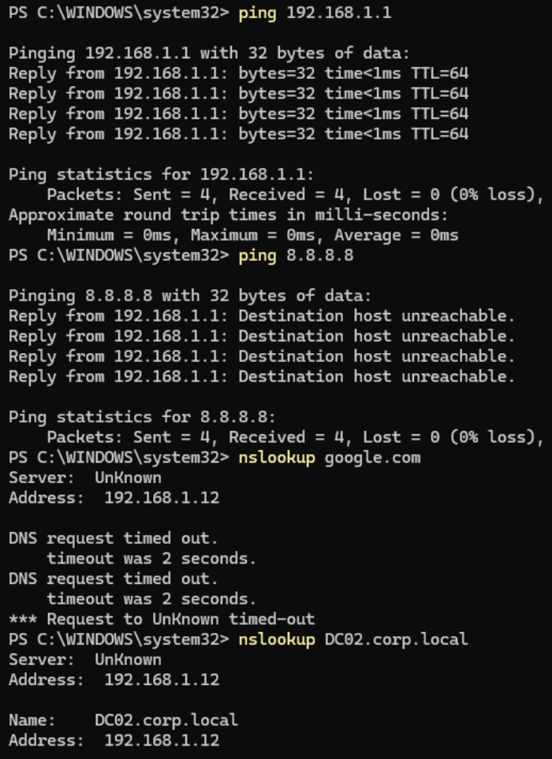
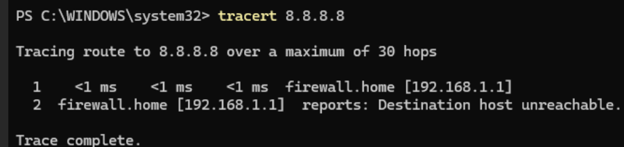
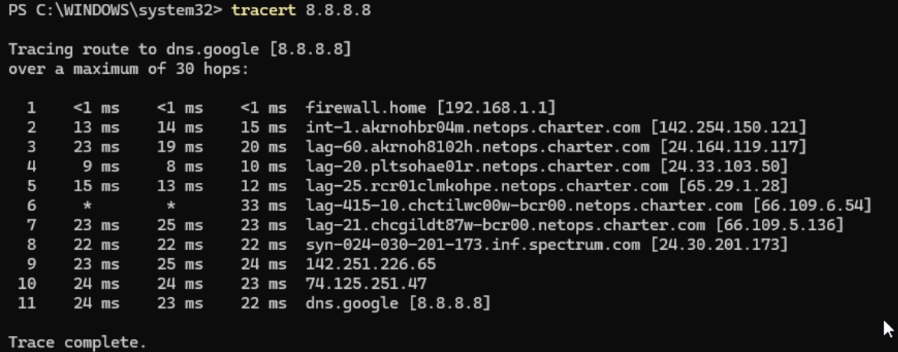

# Lab 03 – Internet Outage Troubleshooting

## Scenario

A domain user reports that internet access is unavailable. Internal domain resources still function correctly.

The goal of this lab is to identify **where the connectivity failure occurs** using common troubleshooting tools.

Possible failure locations include:

* Client configuration
* LAN connectivity
* DNS resolution
* Default gateway
* ISP / upstream network

---

# Lab Environment

Domain: `corp.local`

| System   | Role                     |
| -------- | ------------------------ |
| CL01     | Windows 11 Domain Client |
| DC01     | Domain Controller        |
| DC02     | Domain Controller / DNS  |
| Firewall | OPNsense Gateway         |

Network path:

```
CL01 → Firewall → ISP (Spectrum) → Internet
```

---

# Step 1 – Verify Client Network Configuration

Command:

```
ipconfig /all
```

Screenshot:



Key observations:

* DHCP Enabled
* Valid IPv4 address assigned
* Default Gateway: `192.168.1.1`
* DNS Servers: `192.168.1.12`, `192.168.1.11`

Conclusion:

Client network configuration is valid.

---

# Step 2 – Verify LAN Connectivity

Command:

```
ping 192.168.1.1
```

Screenshot:



Result:

```
Reply from 192.168.1.1
Packets: Sent = 4, Received = 4, Lost = 0
```

Conclusion:

* LAN connectivity working
* Default gateway reachable

---

# Step 3 – Test Internet Connectivity

Command:

```
ping 8.8.8.8
```

Screenshot:



Result:

```
Reply from 192.168.1.1: Destination host unreachable
```

Important observation:

The **router returned the error**, not the client.

This means:

```
Client → Router : SUCCESS
Router → Internet : FAILURE
```

Conclusion:

The firewall cannot route traffic to the internet.

---

# Step 4 – Test DNS Resolution

Command:

```
nslookup google.com
```

Result:

```
DNS request timed out
```

External DNS resolution fails.

However internal DNS still functions.

Command:

```
nslookup DC02.corp.local
```

Result:

```
Name: DC02.corp.local
Address: 192.168.1.12
```

Screenshot:


Conclusion:

| Test         | Result  |
| ------------ | ------- |
| Internal DNS | Working |
| External DNS | Failing |

This indicates the DNS server cannot reach external resolvers.

---

# Step 5 – Trace Network Route

Command:

```
tracert 8.8.8.8
```

Screenshot:



Result:

```
1  firewall.home [192.168.1.1]
2  firewall.home reports: Destination host unreachable
```

Traceroute stops at the firewall.

Conclusion:

The firewall cannot route traffic to the ISP.

---

# Root Cause

The firewall lost upstream connectivity to the ISP.

Evidence:

* Router reports **Destination host unreachable**
* Traceroute stops at gateway
* External DNS queries fail
* Internal domain services still function

This indicates a **WAN / ISP outage**.

---

# Service Recovery

After some time the ISP connection was restored.

Traceroute was run again.

Command:

```
tracert 8.8.8.8
```

Screenshot:



Result:

Traffic successfully reached Google DNS.

Example route:

```
192.168.1.1 → Spectrum backbone → Google → 8.8.8.8
```

Conclusion:

Internet connectivity restored after ISP service recovery.

---

# Troubleshooting Commands Used

```
ipconfig /all
ping 192.168.1.1
ping 8.8.8.8
nslookup google.com
nslookup DC02.corp.local
tracert 8.8.8.8
```

---

# Key Takeaways

1. Verify **local connectivity first**
2. Use **ping to isolate routing issues**
3. Use **nslookup to test DNS**
4. Use **traceroute to locate network failures**
5. Gateway errors often indicate **upstream ISP problems**

---

# Troubleshooting Flow

```
Client
 ↓
LAN
 ↓
Gateway
 ↓
ISP
 ↓
Internet
```

Testing each layer sequentially allows the failure point to be quickly identified.

---

