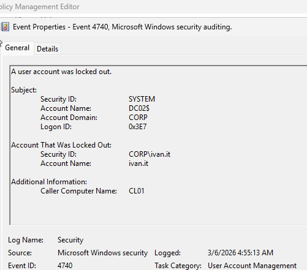
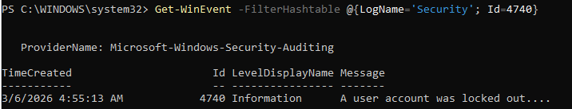

# Lab 04 – Active Directory Account Lockout Investigation

## Objective

Investigate an Active Directory user account lockout and identify:

- Which Domain Controller recorded the event
- The Event ID associated with the lockout
- The computer responsible for triggering the lockout
- How to query lockout events using PowerShell

This lab simulates a common helpdesk ticket:

> "User cannot log in and reports their account is locked."

---

# Environment

| System | Role |
|------|------|
| DC01 / DC02 | Domain Controllers |
| CL01 | Domain joined workstation |
| FS01 | File server |
| User | ivan.it |

Domain:

```
corp.local
```

---

# Step 1 – Simulate the Lockout

On **CL01**, repeatedly attempt to sign in using the wrong password for the user:

```
ivan.it
```

After exceeding the configured lockout threshold, Windows displays:

> **"The referenced account is currently locked out and may not be logged on to."**

### Lockout Screen


---

# Step 2 – Investigate on the Domain Controller

Log into a Domain Controller and open:

```
Event Viewer
```

Navigate to:

```
Windows Logs
Security
```

Filter for:

```
Event ID: 4740
```

Event **4740** indicates:

```
A user account was locked out.
```

### Event Viewer Lockout Record



Important fields in the event:

```
Account Name: ivan.it
Caller Computer Name: CL01
```

This shows that **CL01 triggered the lockout event**.

---

# Step 3 – PowerShell Investigation

Instead of manually searching Event Viewer, administrators often query lockout events using PowerShell.

Run on a Domain Controller:

```powershell
Get-WinEvent -FilterHashtable @{LogName='Security'; Id=4740}
```

### PowerShell Output



This command retrieves security log entries where:

```
Event ID = 4740
```

Meaning:

```
User account lockout events
```

---

# Key Fields to Investigate

| Field | Meaning |
|------|------|
| Account Name | The locked account |
| Caller Computer Name | Machine causing lockout |
| Event ID | Type of authentication event |
| Domain Controller | Server that logged the event |

In this lab:

```
Locked account: ivan.it
Source machine: CL01
Domain Controller: DC02
```

---

# Root Cause Analysis

The account lockout occurred because:

```
Multiple failed authentication attempts exceeded the domain lockout threshold.
```

This commonly happens due to:

- Cached credentials
- Saved Outlook credentials
- Mapped drives
- Scheduled tasks
- Mobile devices with outdated passwords
- Repeated incorrect login attempts

---

# Helpdesk Troubleshooting Workflow

When a user reports account lockout:

1. Confirm the account is locked
2. Check Domain Controller security logs
3. Locate **Event ID 4740**
4. Identify the **Caller Computer Name**
5. Investigate the device causing the authentication attempts
6. Unlock the account and resolve the root cause

---

# Unlock the Account

Unlock using:

```
Active Directory Users and Computers
```

or PowerShell:

```powershell
Unlock-ADAccount -Identity ivan.it
```

---

# Key Concepts Learned

This lab demonstrates:

- Active Directory account lockout investigation
- Security Event ID **4740**
- Domain Controller authentication logging
- PowerShell event log querying
- Identifying the source of failed authentication attempts

---

# Commands Used

```powershell
Get-WinEvent -FilterHashtable @{LogName='Security'; Id=4740}
```

```powershell
Unlock-ADAccount -Identity ivan.it
```

---

# Real World Relevance

Account lockouts are one of the **most common Active Directory helpdesk tickets**.

Understanding how to quickly identify the **source computer triggering the lockout** is a key skill for:

- Helpdesk technicians
- System administrators
- Identity engineers
