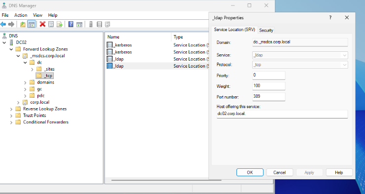
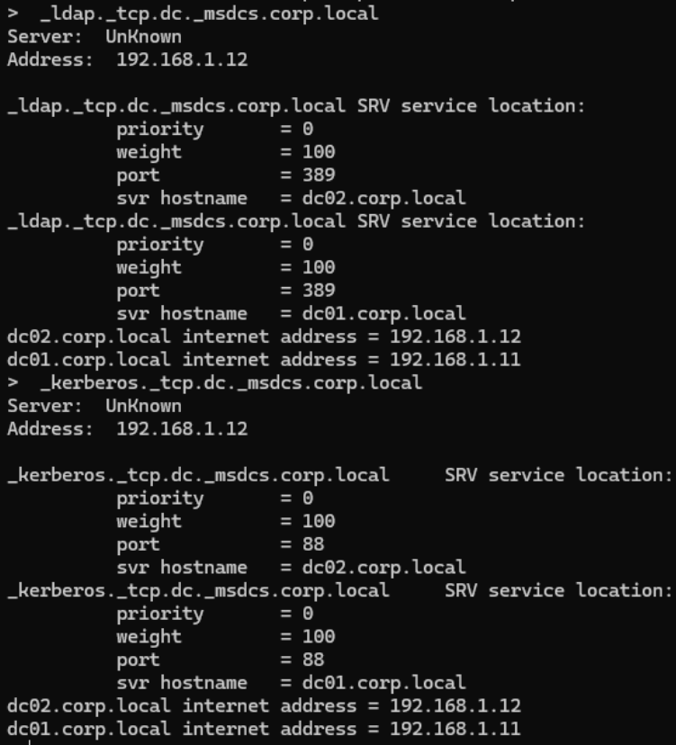
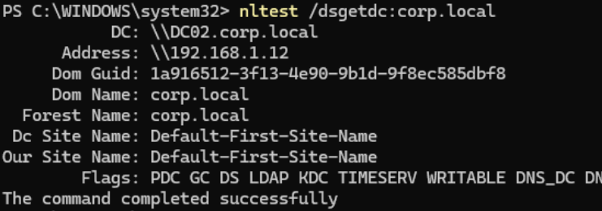
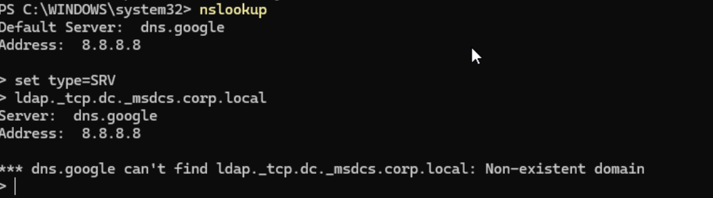

# Lab 05 — DC Locator and DNS Misconfiguration

## Objective

This lab demonstrates how Active Directory clients locate domain controllers using **DNS SRV records** and how authentication fails when a workstation is configured with an **external DNS server instead of the domain DNS server**.

Active Directory relies heavily on DNS to locate authentication services. Domain clients query SRV records such as:

_ldap._tcp.dc._msdcs.corp.local

These records identify which servers provide LDAP and Kerberos authentication services. :contentReference[oaicite:0]{index=0}

---

# Lab Environment

| System | Role |
|------|------|
| DC01 | Domain Controller |
| DC02 | Domain Controller |
| CL01 | Domain Client |

Domain:

corp.local

---

# Step 1 — Verify SRV Records in DNS

Open **DNS Manager** on a Domain Controller.

Navigate to:

Forward Lookup Zones
/ corp.local
/ _msdcs
/ dc
/ _tcp

You should see SRV records for your domain controllers.

These SRV records tell domain clients which servers provide LDAP directory services.

---

# Step 2 — Query SRV Records from a Client

From **CL01**, run:

nslookup
set type=SRV
_ldap._tcp.dc._msdcs.corp.local

Example output:

This confirms DNS knows about both domain controllers.

Example:

dc02.corp.local
dc01.corp.local

---

# Step 3 — Run the DC Locator Command

Run the DC locator command on the client.

nltest /dsgetdc:corp.local

Example output:

Example result:

DC: \DC02.corp.local
Address: \192.168.1.12

This shows the client successfully located a domain controller.

---

# Step 4 — Verify Client DNS Configuration

Check the DNS servers configured on the client.

ipconfig /all

Example:

The client is correctly using the domain DNS servers:

192.168.1.12
192.168.1.11

These correspond to:

DC02
DC01

---

# Step 5 — Simulate DNS Misconfiguration

Now simulate a common real-world issue:  
A workstation configured with **public DNS** instead of the domain DNS server.

Run:

Set-DnsClientServerAddress -ServerAddresses ("8.8.8.8")

The client is now using Google DNS.

---

# Step 6 — Force Domain Controller Discovery

Run:

nltest /dsgetdc:corp.local /force

Example result:

Output:

Getting DC name failed: Status = 1355
ERROR_NO_SUCH_DOMAIN

This happens because Google DNS does not contain Active Directory records.

---

# Step 7 — Verify SRV Lookup Failure

Run the SRV lookup again.

nslookup
set type=SRV
_ldap._tcp.dc._msdcs.corp.local

Example result:

Output:

dns.google can't find _ldap._tcp.dc._msdcs.corp.local
Non-existent domain

The external DNS server does not contain internal Active Directory records.

---

# Root Cause

Active Directory relies on DNS SRV records to locate authentication services.

Clients query records such as:

_ldap._tcp.dc._msdcs.<domain>

These records identify domain controllers that provide LDAP and Kerberos services. :contentReference[oaicite:1]{index=1}

Public DNS servers do not host internal Active Directory zones.

---

# Resolution

Configure domain clients to use the domain DNS servers.

Example:

192.168.1.11
192.168.1.12

After fixing DNS:

ipconfig /flushdns
nltest /dsgetdc:corp.local

Domain controller discovery should succeed again.

---

# Key Takeaways

Active Directory depends heavily on DNS.

Incorrect DNS configuration can cause:

- Authentication failures
- Group Policy issues
- Kerberos failures
- Slow logons
- Domain controller discovery failures

Correct DNS configuration is critical for Active Directory environments.

---

# Useful Commands

ipconfig /all
ipconfig /flushdns
nltest /dsgetdc:corp.local
nltest /dsgetdc:corp.local /force
nslookup
set type=SRV
_ldap._tcp.dc._msdcs.corp.local
Set-DnsClientServerAddress -ServerAddresses ("8.8.8.8")

---
